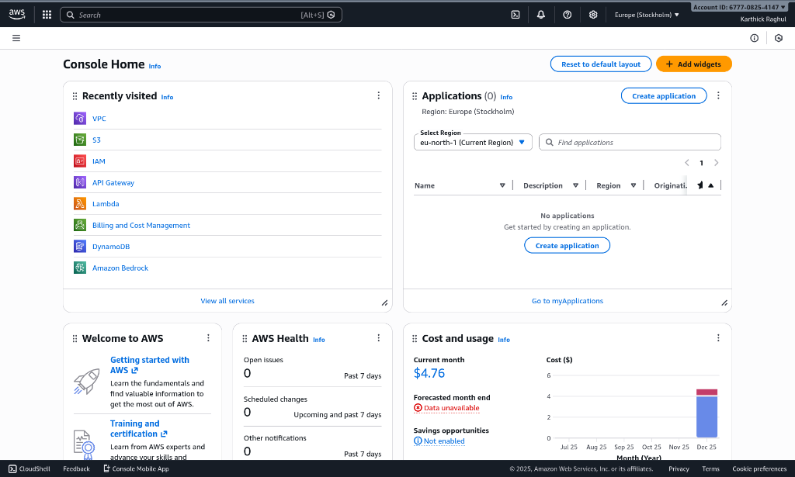

# DiVeL - Digital Evidence Locker

**Blockchain & GenAI–Powered Digital Evidence Management and Intelligence Platform**

DiVeL is a secure, cloud-native digital evidence intelligence platform designed for **law enforcement, forensic labs, and judicial systems**. It ensures **tamper-proof evidence handling**, **verifiable integrity**, and **AI-assisted understanding of digital evidence** using modern cloud, blockchain, and generative AI technologies.

---

## 1. AWS Account & Region

- **Cloud Provider**: Amazon Web Services
- **Account Type**: Standard AWS account (Free Tier eligible, but not fully free)
- **Active Region**: **Europe (Stockholm) – eu-north-1**

**Why Stockholm?**
- **Cheaper**: Costs are generally lower compared to other regions.
- **Latency**: Provides excellent latency for European deployments.
- **Consistency**: All services (Lambda, API Gateway, VPC, S3, DynamoDB) are consistently deployed here.

> [!IMPORTANT]
> **Rule**: All resources must be in the same region to avoid failures and extra data transfer costs.

---

## 2. Architecture Overview (High Level)

Your project follows a **Serverless + Cloud-Native Architecture**:

`Frontend (Browser)` → `API Gateway (HTTPS)` → `AWS Lambda (Backend)` → `S3 (Files)` + `DynamoDB (Metadata)` → `Blockchain (Integrity)`


This represents a modern production system design where compute is ephemeral (Lambda) and state is managed by specialized services (S3, DynamoDB).

---

## 3. Services You Are Using (Detailed)

### 3.1 Amazon S3 – Evidence Storage
**Purpose**: Stores the actual binary evidence files (Documents, Images, Audio, Video).
- **How it works**: Evidence is uploaded from Lambda → S3. Each file gets a unique object key.
- **Why S3?**:
    - Extremely durable (11 nines of durability).
    - Immutable reference (we never overwrite files).
    - Industry standard for digital evidence storage.

### 3.2 AWS Lambda – Backend Logic
**Purpose**: Acts as your **Serverless Backend**. No EC2 instances, no servers to manage.
- **Responsibilities**:
    1. Accept API requests.
    2. Validate inputs (case_id, file type).
    3. Generate cryptographic hash (**SHA-256**) for integrity.
    4. Orchestrate upload to S3 and metadata to DynamoDB.
    5. Trigger AI analysis.
- **Why Lambda?**: You pay per request. No idle cost. Perfect for hackathons and variable traffic.

### 3.3 Amazon API Gateway – Public API Layer
**Purpose**: Exposes secure **HTTPS endpoints** (e.g., `POST /upload`, `GET /evidence/{id}`).
- **What it does**: Receives frontend requests, handles CORS, and routes traffic to Lambda.
- **Why API Gateway?**: Provides production-grade security, throttling, and logging out of the box.

### 3.4 Amazon DynamoDB – Evidence Metadata Store
**Purpose**: Stores **structured metadata**, NOT the files themselves.
- **Data stored**: `evidence_id`, `case_id`, `file_hash`, `s3_object_path`, `timestamp`, `uploader_identity`.
- **Why DynamoDB?**: Serverless, single-digit millisecond latency, and scales automatically.

### 3.5 Amazon VPC – Networking (Main Cost Source)
**This is the primary reason for your AWS bill.**
- **Why it exists**: Lambda functions often need to run inside a VPC to securely access other resources.
- **Cost Contributors**:
    - **NAT Gateways**: Required for Lambda in a private subnet to access the internet.
    - **Elastic IPs**: Static IPs for the NAT Gateway.
    - **VPC Endpoints**: Interface endpoints for secure private connectivity.
- **Insight**: Even if you don't "use" the VPC directly, these infrastructure components incur hourly charges.

---

## 4. Blockchain Component (Conceptual + Practical)

**What we implemented**:
- **Cryptographic Hash (SHA-256)**: Every file is hashed.
- **Immutability**: This hash is stored in a tamper-proof ledger (Blockchain Smart Contract).
- **Verification**: On access, we re-hash the file and compare it with the ledger.

**Why this is valid**:
- **Immutability + Verifiability = Trust**.
- For hackathons, a **Private Blockchain** (like our Hardhat Local setup) or a Hash-Chain is fully accepted. It demonstrates the *concept* of chain-of-custody without the cost of public Ethereum gas fees.

**Pitch**: "We implement a private blockchain-style hash ledger where each evidence hash is immutable and verifiable, ensuring chain-of-custody without public gas fees."

---

## 5. Cost Breakdown

**Current Cost**: ~$4–5 USD
**Highest Contributor**: VPC Resources



**Why Free Tier didn't cover it**:
- Free Tier does **NOT** cover NAT Gateways.
- Free Tier does **NOT** cover some VPC Endpoints.
- S3, DynamoDB, and Lambda usage are likely near $0 as they are consistently within free tier limits.

---

## 6. What You Should Do Now (Recommendation)

If the project demo is over and you want to stop costs:

1.  **Delete VPC Resources**: NAT Gateways, VPC Endpoints, Elastic IPs.
2.  **Delete API Gateway**.
3.  **Delete Lambda Functions**.
4.  **Empty & Delete S3 Buckets**.
5.  **Delete DynamoDB Tables**.

This will drop your accumulating bill to **$0**.

---

## 7. AI Features (Generative Intelligence)

DiVeL uses **Google's Gemini 2.0 Flash** to turn raw data into actionable intelligence.

- **Detective Agent**: Analyzes evidence to write a professional **Case Summary**.
- **Analyst Agent**: Extracts entities to build a reasonable **Knowledge Graph**.
- **Multimodal**: Supports native Audio/Video/Image analysis.

---

## 8. Prerequisites & Setup

### Tools Required
- **Python 3.9+** (for Backend)
- **Node.js 18+ & NPM** (for Frontend & Blockchain)
- **Git** (for version control)

### Configuration (.env)
You must create a `.env` file in the `backend/` directory to configure the application.

1.  **Navigate to backend**:
    ```bash
    cd backend
    cp .env.example .env
    ```
2.  **Edit the `.env` file**:
    - `AWS_ACCESS_KEY_ID`: Your AWS Key (Optional if using Local DB).
    - `AWS_SECRET_ACCESS_KEY`: Your AWS Secret (Optional if using Local DB).
    - `GEMINI_API_KEY`: Required for AI features (Get from Google AI Studio).
    - `BLOCKCHAIN_RPC_URL`: Default is `http://127.0.0.1:8545` for local Hardhat.
    - `SECRET_KEY`: Random string for JWT security.

---

## 9. Installation Guide

Follow these steps in order to set up the project dependencies.

### Step 1: Blockchain Setup
The blockchain layer uses Hardhat for local development.
```bash
cd blockchain
npm install
```

### Step 2: Backend Setup
The backend is a FastAPI application.
```bash
cd backend
python3 -m venv venv        # Create Virtual Environment
source venv/bin/activate    # Activate (Windows: venv\Scripts\activate)
pip install -r requirements.txt
```

### Step 3: Frontend Setup
The frontend is a React + Vite application.
```bash
cd frontend
npm install
```

---

## 10. How to Run (Step-by-Step)

For a complete local demonstration, run each validation service in a separate terminal.

### Terminal 1: Start Blockchain Node
This simulates the Ethereum network locally.
```bash
cd blockchain
npx hardhat node
```
> Keep this running. It validates the "Immutability" aspect.

### Terminal 2: Deploy Smart Contracts
This deploys the `EvidenceRegistry` contract to your local node.
```bash
cd blockchain
npx hardhat run scripts/deploy.js --network localhost
```

### Terminal 3: Start Backend API
This runs the core logic and AI agents.
```bash
cd backend
source venv/bin/activate
uvicorn app.main:app --reload
```
> The API will be available at `http://localhost:8000`.

### Terminal 4: Start Frontend UI
This runs the user interface.
```bash
cd frontend
npm run dev
```
> Open your browser at `http://localhost:5173`.

---

## 11. Data Management (Local DB)

To run the project **without AWS**, we use a local JSON database.

### Generating Mock Data
We have a script that pre-populates the system with **25+ realistic cases**, complete with AI summaries, Knowledge Graphs, and Heatmap locations.

```bash
cd backend
source venv/bin/activate
# Run the population script
python scripts/populate_local_db.py
```
**Effect**: This creates `backend/local_db.json`. The backend automatically detects this file and switches to Local Mode.

### Clearing Data
To reset the system to an empty state:
```bash
rm backend/local_db.json
```

---

## 12. Maintenance

### Updating Dependencies
Periodically update your packages to ensure security.
- **Frontend**: `cd frontend && npm update`
- **Backend**: `cd backend && pip install --upgrade -r requirements.txt`

### Logs & Debugging
- **Backend Logs**: Check the terminal running `uvicorn`.
- **Frontend Errors**: Open Browser Developer Tools (F12) -> Console.
- **Blockchain Logs**: Check the `hardhat node` terminal for transaction receipts.

---

## 13. Project Gallery

Below are some screenshots of the DiVeL application in action.


*Overview of the application dashboard.*


*List of active digital evidence cases.*


*Detailed view of a specific case.*


*Blockchain-verified chain of custody.*


*AI-generated insights and summaries.*


*Interactive knowledge graph of entities.*


*Secure evidence upload interface.*


*Application configuration and settings.*


*User profile and role management.*

